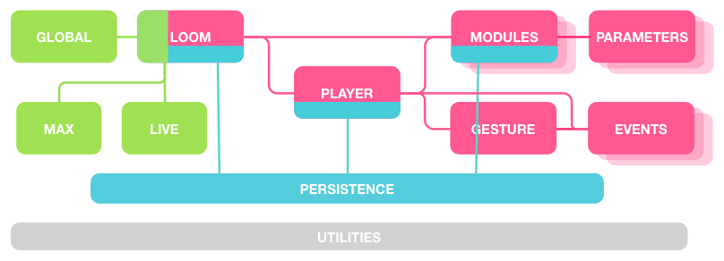

## Loom architecture

This diagram roughly demonstrates the relations between source files:

`Loom` receives messages from `Global` and consults `Live` and `Max`.

It stores data with `Persistence` and manages `Players` and their
`Modules`--where each module corresponds to a device, and each player to a
rack. Both are persisted with `Persistence`.

`Modules` each may have `Parameters` which affect their behavior.

`Players` generate `Gestures` using `Modules`.

`Gestures` contain `Events`. `Players` create additional UI `Events`
in addition to the `Gestures`'.

### Module authoring

Modules register parameters using the `accepts` variable, which is specified as
a JSON object in the format:

    accepts:
        <parameter name>: "<parameter class>""
        <parameter name>: "<parameter class>""

They may override one or more of the following APIs, called by `Player`:

* `populate`: Send any events necessary to initialize or populate parameters'
UI elements.

* `transportStart`: Live transport has started.

* `gestureData` _(gestureData)_: Data to be passed into `Gesture` constructor.

* `gestureOutputComplete`: Player has completed outputting a gesture.

* `remoteOutputComplete` _(remotePlayerId, time)_: Another player ID of
`remotePlayerId` has completed outputting a gesture at `time`.
